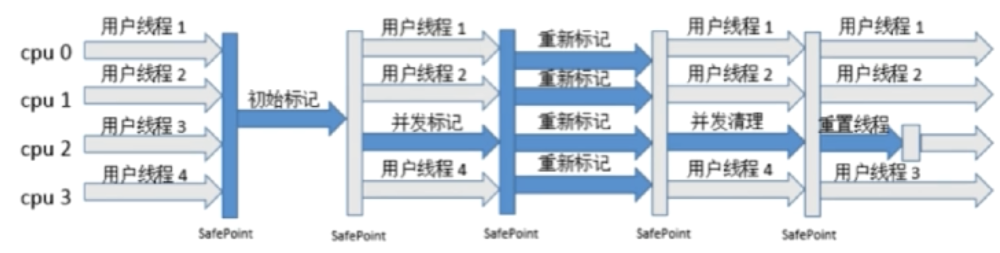

[TOC]
# 网络

## 双工术语


### 全双工

允许数据在两个方向上同时传输。

### 半双工

数据可以两个方向上传输，但是不能同时传输。

### 单工

数据只可以单向传输。


##  TCP

简介：

1. **面向连接的**、**可靠的**、基于字节流的传输层通信协议

2. 将应用层数据**分割成报文**段并发送给目标节点的TCP层

3. 数据包有序号，对方收到则发送ACK确认，没收到ACK报文则重传

4. checksum[校验和]来校验，发送和接收都要计算

   

###TCP报文头【20个字节】

**源端口、目的端口【source port 、destination port 】：**
各占2个字节，所以端口号最大值65,535。TCP、UDP都不包含IP地址信息，只有端口来标识进程。计算机本地进程可以依靠唯一的进程PID来标识，但是远程两台机器PID不唯一，要依靠源端口、目的端口来标识。【IP层ip地址用来唯一标识主机，传输层端口号标识唯一进程】

**序号【sequence number】：**
占4个字节。报文的序号。

**ACK number：**
占4个字节。ACK报文中使用。此数值表示期望下一个收到的报文的序号值。

**offset：**
占1个字节。表示TCP报文的数据距离TCP报文的开始有多远，中间有TCP报文头。

**TCP flags：**
占1个字节。共8个标志位。
	URG:紧急指针标志
x  ACK:确认序号标志。0:报文中不含确认信息，忽略ACK number字段
	PSH:1:报文会被直接push到应用层，而不在缓冲区等待
	RST:重置连接标志。
x  SYN:同步序列号，用于建立连接。[SYN=1无数据。]
x  FIN:finish标志。用于释放连接。

**window：**
占2个字节。表示滑动窗口大小，发送数据的速率。

**Checksum：**
占2个字节。奇偶校验，对整个报文段TCP头部和数据进行计算。

**Urgent Pointer：**
占2个字节。URG=1时有用，表示紧急数据的大小。

**TCP Options**


### 三次握手

1. A发送连接请求报文，[SYN=1,ACK=0,seq=x x为任意整数]。连接状态从关闭【closed】到同步信息发送【 SYN-SENT】。
2. B接收到请求。连接状态从关闭、监听到同步接受【SYN-RCVD】。并且发送回馈报文[SYN=1,ACK=1,seq=y y为任意整数, ack=x+1]。
3. A接受到报文。转态转为连接已建立[ESTABLISHED] 。并返回报文[SYN=0,ACK=1,seq=x+1,ack=y+1]。B接受到报文。转态转为连接已建立。


1、2报文段不可携带数据。即SYN=1。但3可以携带，也可不带。

#### SYN超时

问题：

1. Server收到SYN，并且回复了SYN-ACK，但没收到Client的ACK。此时连接未失败也没成功。**解决方案**：设置了时间，超时算失败。
2. SYN Flood。攻击者在超时前，用多个不同机器发送SYN请求连接，使请求队列满了，不可接受更多请求。**解决方案：**SYN队列满后，设置tcp_syncookies参数，如果其他计算机回发次参数，即使不在SYN队列中，也可以建立连接。
3. 机器故障。机器会通过发送报文，检测对方机器是否正常，如果没有回复则认为机器不正常，断开连接。


### 四次挥手

1. A已无数据需要发送，因此向B发送关闭连接请求[FIN=1, seq=u]状态从Established转到Fin-wait1
2. B收到后，回复[ACK=1, seq=v, ack=u+1]，转态转为close-wait。A收到后，状态转为Fin-wait2，等待B发送剩余数据。
3. B在发送完数据后，发送[FIN=1,ACK=1,seq=w,ack=u+1]，转态转为Last-ACK
4. A回复[ACK=1,seq=u+1,ack=w+1]，状态转为Time-wait在一段时间后转为Closed。B在收到回复后转为Closed转态。


Time-wait转态作用：确保被动关闭连接方收到第四次挥手的ACK，如果没收到被动方会再次发送Fin报文。

被动关闭连接方一直处于Close-wait状态：可能是程序没发送ACK回复，这可能造成过多资源一直被占用，然后无法建立新连接。


### TCP滑动窗口

作用：

1. 保证可靠性。乱序重排
2. TCP流量控制


##  UDP

简介：

1. 面向非连接。
2. 不维护连接，支持同时向多个客户发送相同消息。
3. 报头数据占**8个字节**。额外开销小。
4. 吞吐量不受拥挤控制算法的调节。
5. 尽最大努力交付，不保证可靠
6. 面向报文，不对报文信息进行拆分、合并。应用程序需要控制报文大小。

### UDP报文头【8个字节】

源端口、目的端口：
各占2个字节。


## TCP和UDP区别

1. 面向连接vs非面向连接
2. 可靠vs不可靠
3. 有序性vs无序性
4. 慢vs快


##  HTTP

### 请求结构 

请求行、请求头部、请求数据。

```
请求方法 请求地址 协议版本 
头1: 内容1
头2: 内容2
...
头n: 内容n

数据
--------------------------------------------------------
GET URL HTTP/1.1
Host: ...
...: ...
...

data
```

###响应结构

响应行、响应头、响应体

```
协议版本 转态码
头1: 内容1
头2: 内容2
...
头n: 内容n

数据
---------------------------------------------------------
HTTP/1.1 200 OK
..: ...
..: ...

data
```


### 请求响应步骤

1. 客户端Socket建立简介到web服务器。
2. 客户端发送HTTP请求。
3. 服务端接受请求返回HTTP响应。
4. 释放TCP连接。[如果是HTTP1.0，客户端被动关闭。1.1则保持连接]
5. 客户端解析HTML内容。


### 浏览器输入URL后，流程

1. DNS解析，获得目的IP地址
2. 建立TCP连接
3. 发送HTTP请求
4. 服务器处理请求，返回数据
5. 浏览器解析HTML
6. 连接结束。


### HTTP状态码

**1xx** 请求已接收，继续处理
**2xx** 请求成功
**3xx** 重定向
**4xx** 客户端错误 请求语法错误或无法实现
**5xx** 服务器错误


### GET POST区别

HTTP报文层面：
	GET: 请求参数放在URL中
	POST：请求参数放在报文数据块中

数据库层面：
	GET：符合幂等性和安全性，此类请求通常用来查询操作。	【幂等	性：对数据库的一次操作或多次操作都不改变数据结果。】
	POST：不符合，因为此类请求通常是用来修改数据的。

其他层面：
	GET：可以被缓存、被存储。但POST不可以。


### HTTP 和 HTTPS

HTTPS会新增SSL层，安全版的安全协议。
SSL[Security Sockets Layer]安全套接层：

1. 安全协议
2. 是操作系统对外的API。SSL3.0后改名TLS。
3. 身份验证、数据加密保证数据安全性。


#### 加密方式

1. 对称加密 加密解密使用同一秘钥
2. 非对称加密 加密解密使用不同秘钥。公钥、私钥。
3. 哈希算法 MD5
4. 数字签名 


#### HTTPS传输流程

1. 浏览器将支持的加密算法信息发给服务器。
2. 服务器选择一个算法，以证书的形式回发给浏览器。
3. 浏览器验证证书，结合证书里的公钥，用公钥加密客户生成的秘钥，发送给服务器。
4. 服务器解密，获得客户秘钥，验证，返回用客户秘钥加密的响应信息。
5. 浏览器用客户秘钥解密响应信息，验证，进行加密交互数据。


#### 区别

1. HTTPS需要CA申请证书
2. HTTPS密文传输，HTTP明文传输
3. 端口不一样，HTTPS 443   HTTP 80
4. HTTPS=HTTP+加密+认证+完整性保护


#  数据库

## 关系型数据库设计

1. 程序
   1. 存储管理
   2. 缓存机制
   3. SQL解析
   4. 日志管理
   5. 权限划分
   6. 容灾机制
   7. 索引管理
   8. 锁管理
2. 存储[文件系统]


##  索引

**索引数据结构:**

1. 二叉查找树
2. B-Tree 【B指代Balance】
3. B+-Tree
4. Hash结构
5. BitMap


###    B-Tree


**定义** m阶树  上图为3阶树

1. Root至少有两个孩子
2. 每个节点最多有m个孩子
3. 节点除root和leaf外，至少有ceil(m/2)个孩子
4. 所有leaf位于同一层

**设每个节点有n个关键字信息:**

1. Ki(i=1,2..n)为关键字，且关键字按顺序升序排序
2. 关键字个数n必须满足:[ceil(m/2)-1]<=n<=m-1，即比孩子个数[P指针的个数]少1。
3. Pi指向关键字范围(Ki-1,Ki)的子树


###  B+Tree


### B+树与B-树的区别

1. 非叶子节点的子树指针[P1...Pn]个数与关键字[Ki...Kn]相同。
2. Pi指向的子树的数值范围为[Ki，Ki+1)，比如5下的P1指向的子树的数值范围为[5,10)。B-树是都是开区间(Ki,Ki+1)。
3. 非叶子节点只用来索引，不存储数据，数据都存在叶子节点中。
4. 所有叶子节点都有一个链指针指向下一个叶子节点。更有利于数据库扫描。


### Hash索引

**缺点**

1. 只能满足"="，"in"语句，不能使用范围查询语句。
2. 无法避免数据的排序操作。
3. 当索引是组合索引时候，不能使用其中一个字段做hash索引，只能用组合索引整体做索引，计算hash值。但B+树支持使用组合索引中的部分字段做索引。
4. 不能避免表扫描。
5. 性能不稳定。大量hash值相等的数据，性能比B+树低。


### 索引分类

#### InnoDB索引

1. 普通索引
2. 主键索引
3. 唯一索引


#### 密集索引和稀疏索引


**密集索引**: 每一个数据记录都有对应的索引项

**稀疏索引**: 部分数据记录有索引项


**?MyISAM**: 所有索引都是稀疏索引。

**InnoDB**: 主键索引作为密集索引。

1. 若果有主键被定义，该主键索引作为密集索引
2. 没有定义主键，该表的唯一非空字段索引作为密集索引
3. 不满足上述条件，内部生成一个隐藏的主键，此主键索引作密集索引


#### 聚簇索引和非聚簇索引 [不是一种单独的索引类型，而是根据存储方式划分的种类]

**聚簇索引** 数据行存放在索引的叶子节点下。一个表只有一个聚簇索引。
**非聚簇索引** 数据行和索引分开存放。


**MyISAM**:
使用非聚簇索引，把数据和索引分开存储。

**InnoDB**:
**主键索引**是聚簇索引[也是密集索引]。其他索引都是非聚簇索引【有称不能叫非聚簇索引，说这个词是针对MyISAM的】，又称作**二级索引/辅助索引**，因为用这些索引要查询两次才能定位到数据，它们的叶子节点都存放的是主键值，通过这个主键值到之间索引处进行二次查询。


### 优化慢查询
1. 用日志定位慢查询sql
2. 用explain分析查询sql
3. 修改sql或者让sql尽量走索引


### 联合索引的最左匹配原则

**联合索引**: 由多列组成的索引。内部数据是按照建索引时字段(a1,a2...,an)顺序给数据排序。

设联合索引有N个字段(a1,a2...,an)，where语句有多个条件语句(s1,s2...)。MySQL从联合索引**从最左边字段a1开始向右匹配**，如果**where语句不包含这字段**或**此语句是范围语句**[<,>,between,部分like(like以%开头不用索引，以明确字符开头使用索引)]，则停止匹配，该字段以前的字段都可以用索引。


## 锁

### 种类

**按锁级别划分** 读锁/共享锁、写锁/排它锁

一个资源可以同时存在多个**读锁/共享锁**。当存在1个**写锁/排它锁**时，不能有任何锁，直到这个锁释放。一个**写锁/排它锁**只能等资源没有任何锁的情况下，占有这个资源。

|                 | 写锁/排它锁 | 读锁/共享锁                   |
| --------------- | ----------- | ----------------------------- |
| **写锁/排它锁** | 冲突        | 冲突                          |
| **读锁/共享锁** | 冲突        | <font color="red">兼容</font> |

**按锁的粒度** 行级锁、表级锁、页级锁

**按加锁方式** 自动锁、显示锁

**按操作方式** DML锁、DDL锁

**按使用方式** 乐观锁、悲观锁


### 表级锁 行级锁

MyISAM用的是表级锁，不支持行级锁。
InnodDB支持行级锁[索引查询]，也支持表级锁[非索引查询]。根据情况选用不同的锁。

|        | 行级锁                                     | 表级锁                                       |
| ------ | ------------------------------------------ | -------------------------------------------- |
| MyISAM | 不支持                                     | 支持                                         |
| InnoDB | 支持<br />[操作加锁并且**走索引**是行级锁] | 支持<br />[操作加锁并且**不走索引**是表级锁] |

InnoDB中，普通的select是不加任何锁的。
**读锁/共享锁**，select末尾加上**lock in share mode**。
**写锁/排他锁**，seledt末尾加上**for update**。


### ACID事务四大特性

A 原子性: 事务里的所有操作是一个工作单元，要不全部发生，要不全部回滚。

C一致性: 事务开始前后，数据库的完整性和业务逻辑上的一致性不被破坏。

I隔离性: 事务之间即时操作相同的数据也互不影响。

D持久性: 事务提交后，数据更变后应该永久保存，不会被回滚。


### 不同的隔离级别和问题

| 隔离级别         | 脏读 | 不可重复读 | 幻读 |
| ---------------- | ---- | ---------- | ---- |
| READ UNCOMMITTED | Y    | Y          | Y    |
| READ COMMITTED   | N    | Y          | Y    |
| REPEATABLE READ  | N    | N          | Y    |
| SERIALIZABLE     | N    | N          | N    |


### InnoDB 默认事务隔离级别RR如何避免幻读

**幻读**: 事务A不同时间同样的sql，返回结果不同，因为事务B在期间对数据操作并且提交。例如select count(1) from student;，返回不同的结果。

#### 使用快照读 一定程度避免幻读

**快照读** [不加锁的数据读取]

1. 读取的是数据快照，数据被修改，快照无法察觉，所以不会产生幻读。
2. **不加锁的非阻塞select**是快照读。普通的select[RR级别下，不加锁]读取到的是快照，事务中直到第一次调用此select时，才会对数据进行快照。


##### 快照怎么实现? MVCC

**undo日志**
事务提交**update/delete/insert**的时候，相关的数据行记录到**undo日志**里，日志里保存了修改前旧版本数据的内容。当操作相关数据行的所有事务提交后，这些记录会被删除。


**快照读过程**
快照读的时候，在undo日志中，找小于等于当前事务版本号的记录。版本号其实是上图的**DB_TRX_ID**[事务ID，后发生的事务ID比较大]


#### 使用next-key锁 避免当前读产生的幻读

**当前读**[加锁的数据操作]

1. 读取数据的最新版本，**所以当有其他事务提交时，会产生幻读。**
2. 以下都是使用当前读，即加锁的数据操作
   1. 加锁的select。select ... lock in share mode / for update
   2. update/delete/insert

InnoDB为了避免**当前读**时产生幻读，会使用**next-key锁**，对读取的数据进行加锁，不得被修改。

**next-key锁** 行锁+Gap锁[间隙锁]


##### Gap锁 

设被上Gap锁的区间为A区间，阻塞情况有
	insert  在A区间内的记录会阻塞。
	update 把A区间外的索引，update成A区间内都会被阻塞。

**在使用*当前读*的情况下**:

* 使用**主键索引**或者**唯一键索引**
  * where**命中的条件**，只有行锁，没有Gap锁。
  * where**没命中的条件**，会用为没命中的索引上Gap锁。**索引按照(主键/唯一索引)规则排序**，区间为距离这索引最近的左右两个索引值(l,r)。
  
* 使用**普通索引**

  * 无论条件是否命中，都使用Gap锁。
  * **索引按照(普通索引，主键索引)规则排序**，**无论where条件是否命中**，都会加Gap锁。区间为距离这索引最近的左右两个索引值**(l,r)**，而且对普通索引命中的记录主键要上行锁。
  


* **不使用索引**

  * 会锁住所有gap，而且会使用表锁。事务提交前，其他事务的**当前读**会阻塞。


## 范式

### 第一范式

数据库表中的所有字段值都是不可分割的原子值

### 第二范式

满足第一范式,**表中的字段必须完全依赖于全部主键而非部分主键。**

### 第三范式

满足第二范式，**非主键外的所有字段必须互不依赖。**


## 分表 分区 分库

### 分表 分区

**分表**是把一个表分成实体存在的多个表。分表后，**单表的并发能力提高了，磁盘I/O性能也提高了**。重点**是存取数据时，提高mysql并发能力上。**

**分区**还是只有一个表，只是这个表的数据被分成不同的区块存储。重点**突破磁盘的读写能力**，从而达到提高mysql性能的目的。


# JVM

## 面试题 

### 对java的理解

**平台无关性**
**GC**
**语言特性**
**面向对象**
**类库**
**异常处理**


#### 平台无关性

一次编译，到处运行。源码被编译成字节码文件，不同平台的JVM加载字节码文件，最终解释成机器码运行，不用重新编译。[javap是jdk自带的反编译工具，可用来反编译字节码]


### 什么是反射

Java反射是指运行时，对于类，可以知道它的所有方法和属性；对于对象，可以调用它的所有方法和属性。这种动态获取信息和动态调用的功能称为反射。


## JVM结构 


主要4大部分:

  1. Class Loader[类加载器] 加载class文件到内存
 	2. Runtime Data Area[运行时数据区] JVM内存结构模型
 	3. Execution Engine[执行引擎] 对命令进行解析
 	4. Native Interface[本地库接口] 融合不同的开发语言的原生库为Java所用


### JVM内存模型


#### 程序计数器 PC Register

1. 线程私有
2. 当前线程执行的字节码**行号指示器**
3. 改变计数器的值来选取下一条要执行的字节码指令。
4. 正在执行java方法，值为字节码指令的地址。native方法，则为空值Undefined。
5. 唯一一个在JVM规范中**没有规定OutOfMemoryError情况**的区域。


#### 虚拟机栈 JVM Stack

1. 线程私有，生命周期与线程相同。
2. 自动释放内存。
3. 保存java方法执行的数据结构**栈帧**。
4. JVM规范定义了两种异常
   1. **StackOverflowError** 栈深度大于虚拟机的允许(即方法嵌套过多，比如递归深度过深)。
   2. **OutOfMemoryError** 栈的内存过大，扩展内存时，无法申请到足够大的内存。比如创建N个线程。


##### 栈帧

每个方法在执行的同时会产生一个叫栈帧的数据结构。方法**调用到执行完成**，对应着栈帧在虚拟机栈中的**入栈到出栈**。
数据结构包含以下信息:

1. 局部变量表 保存编译器可知的基本数据类型和对象引用

 	2. 操作数栈 
 	3. 动态链接
 	4. 方法出口
 	5. ...


#### 本地方法栈 Native Method Stack

1. 本地方法栈与虚拟机栈相似，只不过本地方法栈是为native方法服务。
2. JVM规范没有强制规范其实现方式、数据结构，虚拟机可以自由实现。
3. 有的虚拟机把虚拟机栈和本地方法栈合并。
4. 与虚拟机栈一样会有**StackOverflowError** 和 **OutOfMemoryError**。


#### 堆 Heap

1. 线程共享。所有线程共享这块区域。
2. 虚拟机启动时创建，用于存放对象实例。
3. 物理上不连续但逻辑上连续的存储空间。
4. GC垃圾收集的主要管理区域。
5. **OutOfMemoryError** 产生过多没有对象实例，而且未被GC回收。


##### 新生代和老年代

**JDK1.7 1.8** 中，HotSpot将**堆**划分为**新生代**和**老年代**。
**新生代**又划分为: 一个**Eden**、两个**Survivor**空间。比例是**8:1:1**。


##### 堆栈大小参数调优

-Xss 规定每个线程虚拟机栈/堆的大小

-Xms 堆的初始大小

-Xmx 堆能达到的最大值

-Xmn 设置新生代大小

一般设置 -Xms 和 -Xmx 一样大小，因为内存扩大会影响程序运行。


#### 方法区 Method Area

1. 线程共享。
2. JVM规范中，方法区在虚拟机启动的时候创建，虽然方法区是堆的逻辑组成部分，但是简单的虚拟机实现可以选择不在方法区实现垃圾回收与压缩。
3. 存储被虚拟机加载的类信息、常量[常量池 Runtime Constant Pool，后来被移动到堆中]、静态变量等数据。
4. **OutOfMemoryError** 无法满足内存分配需求。[程序运行时，动态加载过多的类]


##### 方法区的一种实现 永久代PermGen Space

方法区[Method Area]是JVM的一种规范，而永久代是Hotspot虚拟机对这种规范的一种实现。
**JDK1.7**时，永久代中的**常量池**被移除到**堆Heap**中。
**JDK1.8**时，用**元空间**代替**永久代**。


#####  [永久代(PermGen)和元空间(Metaspace)](https://www.cnblogs.com/paddix/p/5309550.html)

HotSpot虚拟机在1.8之后已经取消了永久代，改为元空间，类的元信息被存储在元空间中。元空间没有使用堆内存，而是与堆不相连的本地内存区域。


##### 常量池

原本在永久代中，但后来被放到堆中，可以避免一些OutOfMemoryError，常量池大小不受永久代大小约束。


##### String intern 在不同JDK版本的区别

如果常量池中，存在次字符串，则这个字符串; 如果常量池中不存在:
	JDK1.6: 将创建此字符串的副本放入常量池，但是副本是个新对象，引用地址不相同。
	JDK1.6后: 将次字符串的引用放到常量池，而不是创建一个新的副本。


## JVM如何加载class文件? 

### 类的加载过程

1. **加载阶段** ClassLoader加载字节码进内存，生成java.lang.Class对象放在方法区中[Method Area]

2. **连接阶段** 此阶段部分内容与加载交叉进行，例如验证字节码
2.1 **验证** 检查字节码是否符合规范，不会危害JVM。
   2.2 **准备** 为**类变量**分配内存和设置**零值**[而不是初始化的值]，而初始化值是在初始化阶段进行。但如果类变量的值是常量[修饰符static final]，那么会直接设置初始化值。
   2.3 **解析** 将常量池内的符号引用转为直接引用。
  
3. **初始化阶段** 执行类构造器<clinit>()[所有类变量的赋值动作+static代码块]


### 类加载器ClassLoader

**作用**: 在类加载过程中的加载阶段，负责将字节码文件加载进内存，所有Class都由ClassLoader加载进内存。


#### 类加载器种类

1. BootStrapClassLoader C++编写，加载核心库java.*
2. ExtClassLoader Java编写，加载扩展库javax.*
3. AppClassLoader Java编写，加载程序所在目录/classpath的类
4. 自定义ClassLoader 


#### 双亲委派模型 [Parents Delegation Model]
除了顶层类加载器，其它加载器都有父类加载器。他们之间并没有java继承关系，是逻辑上的父类


**ClassLoader加载类的过程**
当一个类加载器接受到类加载的请求

1. 从当前加载器开始查询是否已将加载过此类，
   1. 有，则返回
   2. 没有，则委托父类加载器
2. 如果最终到顶层启动类加载器也没有加载过此类。那么会从顶层开始尝试加载目标类。
   1. 加载成功，则返回。
   2. 加载失败，就是当前加载器加载不到目标类，那么会向下层委托加载目标类。
   3. 没有加载器能加载到目标类，则抛出ClassNotFoundException异常。

**为什么使用双亲委派模型加载类?**
避免字节码被多次重复加载。


#### ClassLoader对象loadClass 和 Class.forName 区别

loadClass: 加载类并没有到连接阶段，不会执行static代码块。
forName: 加载类完成了初始化阶段，会执行static代码块。

在Spring中使用loadClass作为延迟加载，加快启动速度。类的初始化工作留到实际使用到这个类的时候再做。


# GC

## 判断对象生存还是死亡

### 引用计数算法

**实现**: 给对象添加一个引用计数器，每当有一个地方引用就+1，引用失效-1。当这个值为0时，意味对象死亡。

**优点**: 实现简单，效率快。
**缺点**: 无法解决循环引用问题，会导致内存泄露。


### 可达性分析算法[Java使用此算法]

实现: 把**GC Roots**作为起点，对象作为终点，检查对象是否可达，如果能找到一条路径[引用链]到一个对象，那么这个对象存活，否则死亡。

**可作为GC Roots的对象**

1. 虚拟机栈[栈帧中的本地变量]中引用的对象。
2. 方法区中类静态属性引用的对象。
3. 方法区中常量引用的对象。
4. 本地方法栈中JNI[Java Native Interface，即Native方法]引用的对象。


### 被回收的对象

GC会回收真正死亡的对象。真的死亡指**对象不可达，并且无法通过finalize方法成为可达的对象。**

一个对象要被回收需要两次标记，第一次标记证明对象不可达，第二次证明对象执行finalize后也不可达。
第一次: JVM中，不可达的对象被标记。
第二次: 没必要执行finalize的对象[**没覆盖finalize方法**或者**JVM曾调用过一次**]；有必要执行，但执行后，对象还是不可达的对象。

#### finalize方法

特点:

1. 只运行一次
2. 不保证能运行到结束。

当一个对象有必要执行finalize方法，此对象会被放入F-Queue队列中，随后JVM用Finalizer线程去执行finalize方法。


## 垃圾回收算法

### 标记-清除算法 Mark and Sweep

它是最基础的算法，后续算法都是根据此算法不足进行改进得到的。

**实现**: 

1. **标记** 标记需要被回收的对象。
2. **清除** 标记完成后统一回收被标记的对象。

**缺点**:

1. 效率不高。标记和清除效率不高。
2. 空间碎片化。回收后空间不连续，影响大对象的空间分配，当没有足够大的内存分配给大对象时，会体检触发另一次垃圾回收。


### 复制算法 Copying

这个算法解决**标记-清除算法**的两个问题，效率低和空间碎片化。**一般适合新生代。**

**实现**: 将一块内存分为大小相同的两块，只使用其中一块。当一块用完，就将存活对象复制到另外一块空闲内存中[此块内存是按顺序填充，不会出现碎片化内存]，然后清理已使用的内存块。

**优点**: 效率高。空间连续。

**缺点**: 会浪费部分空间，所以只适合对象存活率低的场景。

JDK1.7 1.8，HotSpot默认对新生代区域使用此种算法。Eden区只会向外复制，不会有对象复制进Eden，新创建对象放在Eden区，两个Survivor作为相互复制的两块内存，同一时间只有Eden区加1个Survivor区作为存储空间，只有1个Survivor区的空间(10%)被浪费，当发生垃圾回收时，Eden区和一个Survivor区的对象复制到另一个Survivor区。

**堆内空间分配：**Eden + Survivor + Survivor [8:1:1]


### 标记-整理 Mark-Compact

这个算法适合**对象存活率高**的场景，而且没有碎片化空间。**一般适合老年代。**

**实现**: 与**标记-清理**算法相似。但第二步，不是清理，而是整理。整理是把存活对象向前移动覆盖掉被回收的对象，使内存空间连续，末端内存全部回收。


### 分代收集算法 Generational Collector

根据对象的不同的生命周期划分区域，对不同区域使用不同的回收算法。
**新生代[Young Generation]对象存活率低**: 使用**复制算法**。每次回收有大批对象死去，不需要太多空间，使用**标记-清理/整理**效率慢。
**老年代[Old Generation]对象存活率高**: 使用**标记-清理/整理**。每次回收有大批对象存活，需要大量空间，使用复制算法可能会空间不足。

| JDK1.6  JDK1.7 栈分区+老年代                                 | JDK1.8 栈分区[老年代被移除]                                  |
| :----------------------------------------------------------- | ------------------------------------------------------------ |
|  |  |


#### Minor GC 和 Major GC/ Full GC

**Minor GC**: 发生在新生代的垃圾回收。频繁，速度较快。
**Major GC/ Full GC**: 发生在老年代的垃圾回收。不频繁，速度一般比Minor GC慢10倍以上。 

**Major GC/ Full GC触发条件**:

1. 老年代空间不足
2. 永久代空间不足
3. Minor GC后产生晋升老年代的对象，在老年代没有足够空间存放。
4. 调用System.gc()


## 对象分配策略

### 新生对象分配到新生代的Eden区

* Eden有足够空间，新对象会被分配到Eden区。
* Eden空间不够，触发Minor GC后，
  * 空间足够，将新对象放到Eden区。
  * 空间依然不足，新对象将会放到老年代区域。


### 对象从新生代晋升到老年代

1. 长期存活的对象。经历一定次数Minor GC，依旧存活的对象。[**-XX:MaxTenuringThreshold** 设置次数，超过这个次数放入老年代]
2. GC后，新生代空间依然不足以放下的对象。当Eden装不下一个对象时，先触发Minor GC后，Eden区或Survivor区依旧放不下的对象。
3. 新生成的大对象。[**-XX:PretenuerSizeThreshold** 设置大对象大小，超过这个大小直接放入老年代]


##垃圾回收器Garbage Collectors  [垃圾回收算法的实现]

### Stop-the-world [STW]

```
GC发生时必须停顿所有线程，为了保证可达性分析的准确性，不停顿那么对象可达性会有不断变化。
```


### OopMap[Ordinary Object Pointer Map]
通过OopMap，JVM可以得知对象引用存放的位置[可作为GC Roots的对象]，不用去不同的内存区中扫描找出对象引用，这可以协助GC Roots的枚举快速完成，以便完成可达性算法


### 安全点[Safepoint]

1. 一个特定的位置，用来生成**OopMap**。
2.  这个位置的选取标准是**让程序长时间执行的地方[例如方法调用、循环、异常跳转等]**。
3. 安全点数量不可过多，过多会影响性能。


### 垃圾回收器分类

**新生代垃圾回收器**[专门回收新生代] Serial、ParNew、Parallel Scavenge、G1
**老年代垃圾回收器**[专门回收老年代] Serial Old、Parallel Old、CMS[Concurrent Mark Sweep]、G1


### 新生代的垃圾回收器 

#### Serial

1. 单线程垃圾回收器。
2. 采用复制算法回收新生代。
3. GC时，暂停所有用户线程。


#### ParNew

1. 多线程垃圾回收器。其实是Serial的多线程版本。
2. 也是采用复制算法回收新生代。
3. GC时，暂停所有用户线程。


#### Parallel Scavenge

1. 多线程垃圾回收器。

2. 采用复制算法回收新生代。

3. GC时，也会暂停所有用户线程。

4. 这个回收器更加注重吞吐量，而不是缩短用户线程停顿时间。有利于提高CPU使用率，主要适合后台运算多且交互少的任务。

   $吞吐量=\frac{运行用户代码时间}{(运行用户代码时间+GC时间)}$

5. 控制吞吐量的参数

   1. -XX:MaxGCPauseMillis GC最长时间
   3. -XX:GCTimeRatio 吞吐量大小
   4. -XX:+UseAdaptiveSizePolicy 开启后，有些参数可以自动调配，不用人工调整。
   


### 老年代的垃圾回收器 

#### Serial Old

1. 单线程垃圾回收器。

2. 采用**标记-整理**算法回收老年代。

3. GC时，暂停所有用户线程。


#### Parallel Old

1. 多线程垃圾回收器。
2. 采用**标记-整理**算法回收老年代。
3. GC时，也会暂停所有用户线程。


#### CMS[Concurrent Mark Sweep]

1. 以获得最短回收停顿时间[Stop-the-world]为目标的收集器。
2. 采用**标记-清除**算法回收老年代。会产生空间碎片。
3. 4个步骤。**只有初始标记、重新标记会Stop-the-world，后者会比前者长。并发标记、并发清除耗时长。**
   1. **初始标记**[CMS initial mark] 标记GC Roots直接关联的对象，速度快。
   2. 并发标记[CMS concurrent mark] 追溯GC Roots相连的对象。
   3. **重新标记**[CMS remark] 对并发标记期间因用户线程运行导致标记产生的变动进行修正。
   4. 并发清除[CMS concurrent sweep] 





#### G1[Garbage First]

1. 并行并发
2. 分代收集。 新生代使用复制算法。老年代使用标记-整理算法
3. 可预测停顿。可以指定停顿时间长度，不超过N毫秒。
4. 将堆化成多个区域Region，新生代老年代不再物理隔离，它们由不连续的Region组成。后台维护优先列表，优先回收价值最大的Region。


## 垃圾回收参数调优

-XX:SurvivorRatio Eden和Survivor的比例，默认8:1。

-XX:NewRatio 新生代和老年代的内存大小比例。

-XX:PretenuerSizeThreshold 对象直接进入老年代的最小阈值。

-XX:MaxTenuringThreshold 设置对象经历GC次数的最大阈值，超过这个次数放入老年代


### 各个回收器组合

#### -XX:+UseSerialGC

    Serial + Serial Old

#### -XX:+UseParNewGC

    ParNew + Serial Old

#### -XX:+UseParallelGC

    Parallel Scavenge + Serial Old

#### -XX:+UseParallelOldGC

    Parallel Scavenge + Parallel Old

#### -XX:+UseConcMarkSweepGC

    ParNew + CMS[Concurrent Mark Sweep] + Serial Old[CMS碎片过多时，备用标记-整理]


### JVM默认参数 GC回收器

**通过命令查询**:

```java
> java -XX:+PrintCommandLineFlags -XX:+PrintGCDetails -version
```


