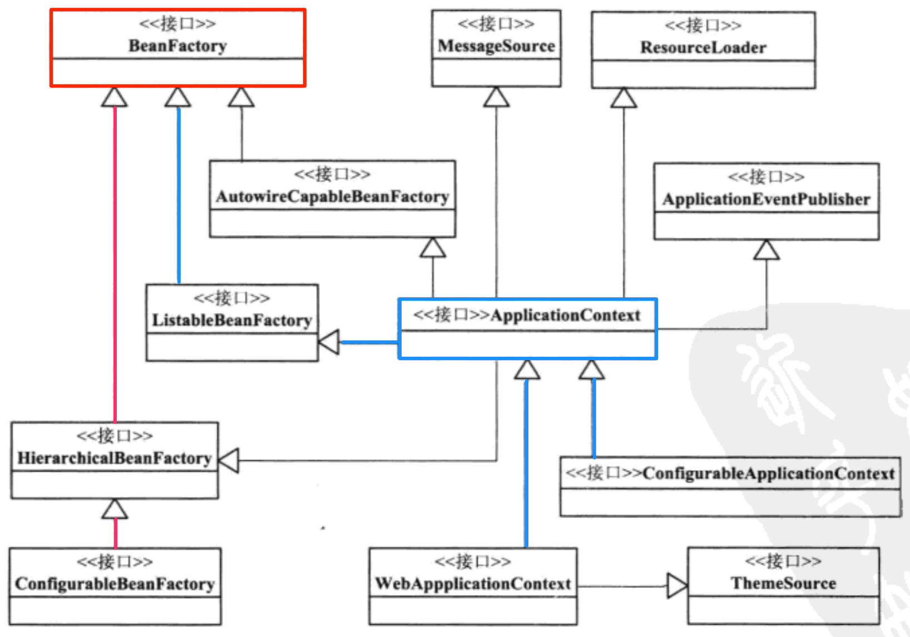

[TOC]

# IOC 容器的实现

## IOC的设计与实现

### 两条重要的设计路线

BeanFactory和ApplicationContext是两个重要的接口，也是IOC的具体体现。

* 红线: 
  1. BeanFactory 
  2. HierarchicalBeanFactory 增加父子容器的相关功能接口
  3. ConfigurableBeanFacotry 定义配置BeanFactory的方法

* 蓝线: 
  1. BeanFactory 
  2. ListableBeanFactory 强化BeanFactory的接口功能，提供遍历获取Bean的方法，而不是单一通过name获取。
  3. ApplicationContext 
  4. WebApplicationContext / ConfigurableApplicationContext

### 设计原理

BeanFactory只定义了基本的IOC容器使用功能。其他子类接口是在此基础上添加其他功能进行扩展。

### DefaultListableBeanFactory

是一个默认的功能比较完整的IOC容器实现。

### Resource

Spring用来封装IO操作的接口。

子类有

* FileSystemResource
* ClassPathResource

### BeanDefinitionReader

解析Resource内容。

### BeanDefinition

IOC容器中的一种数据结构表示Bean的定义信息。

### IOC初始化过程

1. 定位Bean定义信息的位置
2. 加载这些信息生成BeanDefinition
3. 注册BeanDefinition到容器的map中

#### 加载BeanDefinition信息

