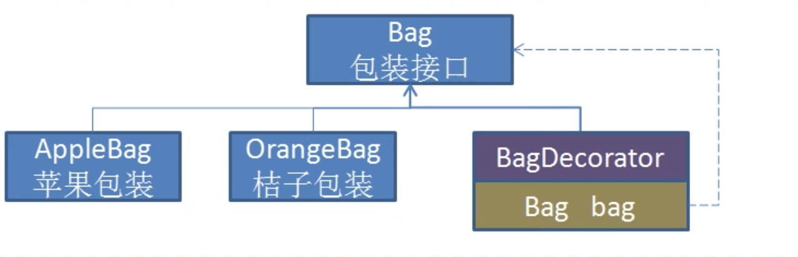
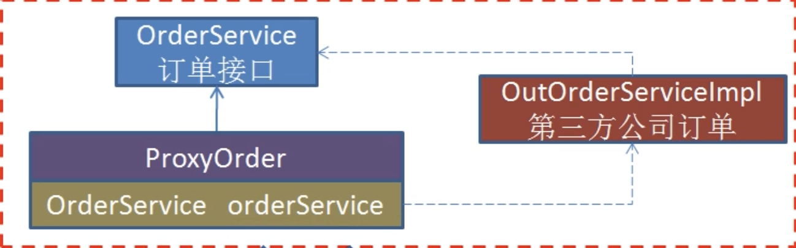
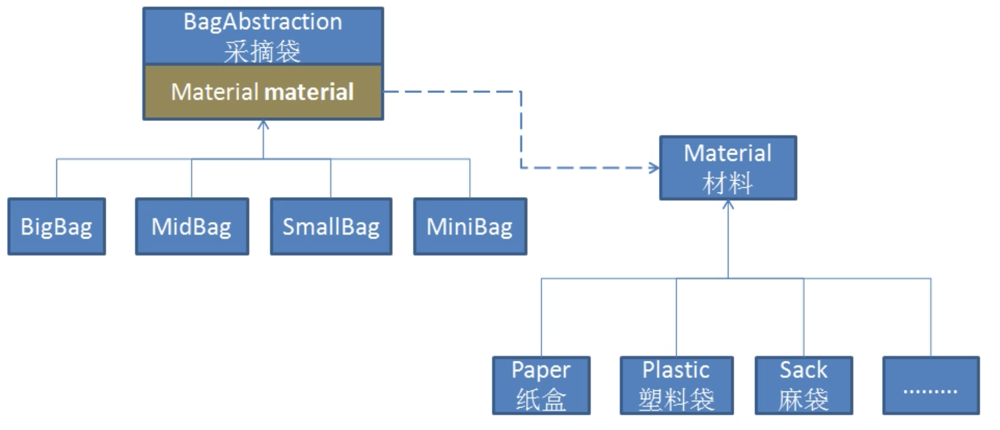
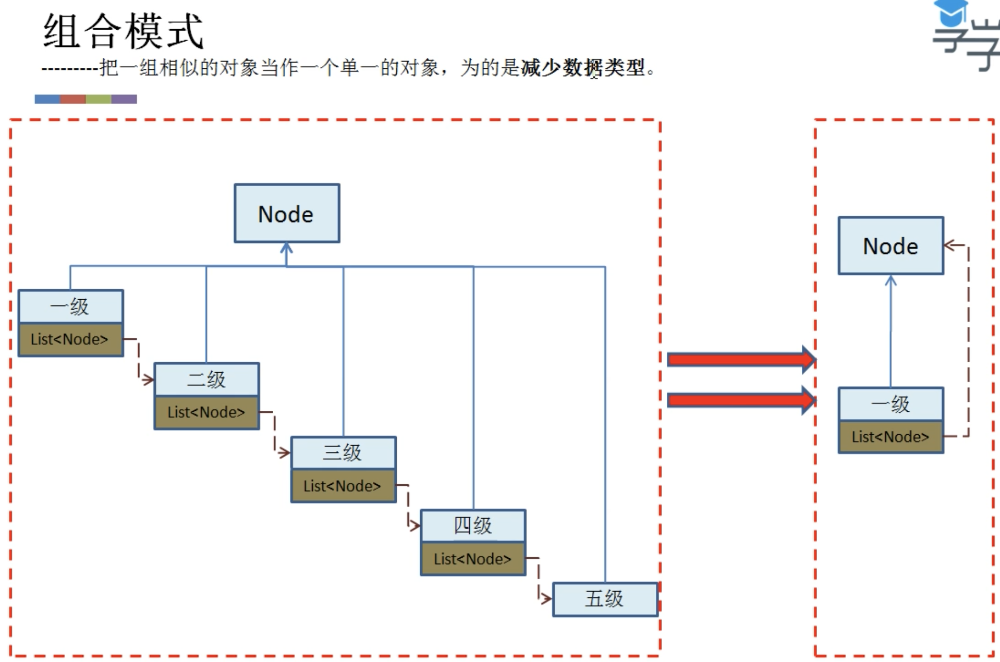

[TOC]

# 设计原则

## 开闭原则

对扩展开发，对修改关闭。

需求修改时，不修改原有部分，而只是进行扩展。


## 单一职责原则

一个类只负责一个职责，模块化的设计。

当需求发生改变时，单一职责可以使粒度更细，改变更小。


## 里式替换原则

父类作为基类引用，可使用不同的子类替换，功能不受影响，但是反过来不可以。子类可以扩展父类的功能，但尽量不改变父类原有的功能。


## 依赖倒置原则

高层模块不应该依赖低层模块，两者都应该依赖其抽象。要面向接口编程，不要面向实现编程。


## 接口隔离原则

接口尽量小，但是要有限度，可以预防外来变更的扩散，提高系统的灵活性和可维护性。一个接口只服务于一个子模块或业务逻辑。


## 迪米特原则

如果两个软件实体无须直接通信，那么就不应当发生直接的相互调用，可以通过第三方转发该调用。


## 合成复用原则

复用时，要尽量先使用组合或者聚合等关联关系来实现，其次才考虑使用继承关系来实现。


# 单例类

##实现1

```java
public class Singleton {
  private static volatile Singleton instance = null;
  private Singleton(){}
  
  public static synchronized Singleton getInstance(){
    if(instance == null) {
      instance = new Singleton();
    }
    return instance;
  }
}
```


##实现2

```java
public class Singleton {
  private static volatile Singleton instance = null;
  private Singleton(){}
  
  public static Singleton getInstance(){
    if(instance == null) {
      synchronized(Singleton.class) {
        if(instance == null)
          instance = new Singleton();
      }
    }
    return instance;
  }
}
```


##实现3

```java
public class Singleton {
  private Singleton(){}
  
  private static class Holder {
    private static Singleton instance = new Singleton();
  }
  
  public static Singleton getInstance(){
    return Holder.instance;
  }
}
```


# 装饰器模式和代理模式区别

## 装饰器模式



## 代理模式



目的不同

* 装饰器模式 - 增强功能
* 代理模式 - 提供代理功能

目标对象不同

* 装饰器模式的增强对象是不固定的
* 代理模式的代理对象是固定的，硬编码


# 桥接模式



**目的** 分离两个维度的东西，通过组合使用关联在一起。可分离两个属性[如上图，大小、材料] 或 类的结构功能和类的功能实现 等等。


# 组合模式

将层级结构用简单的对象表示。




# 门面模式

设计一个接口门面只对客户提供少量方法，方法中具有复杂操作，可以减少客户调用时发生错误，屏蔽细节。

 

# 模板方法

业务主流程在父类设计好，细节在子类实现。


# 策略模式

将策略抽象出来成多个策略类，通过注入不同的策略对象，从而改变行为。


# 责任链模式

# 命令模式

# 访问者模式

将访问/处理与数据结构分离开。