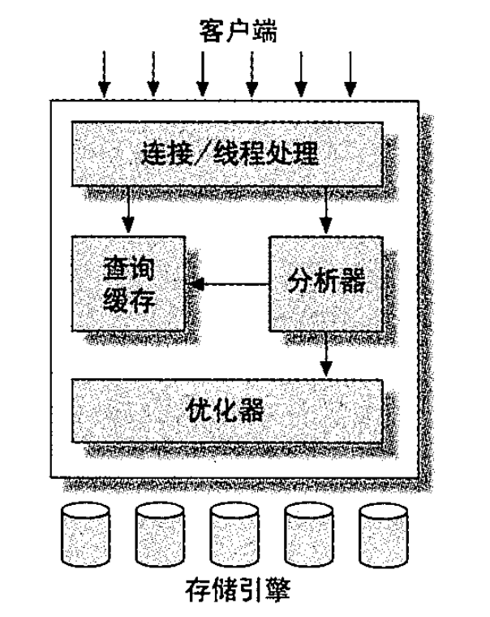

[TOC]

# 1 Mysql 架构与历史

最与众不同的特性是存储引擎架构。这种架构将查询处理(Query Processing)、其他系统任务、存储/提取相分离。这种设计可以再使用时根据性能、特性、需求，选择数据存储的方式。

## 1.1 mysql逻辑构架

### 1.1.2 优化与执行

Mysql会解析查询，创建解析树，并对其进行优化，包括重写，table读取顺序，选择索引等。用户可以通过特殊关键字对优化进行干涉。explain可以查看优化过程。

对于select语句，在解析之前会先检查是有缓存这个结果，如果有直接返回，否则就会查询解析，优化，查询，返回结果。

## 1.2 并发控制

服务器层并发控制、存储引擎层并发控制。

### 1.2.1 读写锁

读锁：共享锁。多个线程可以同时读取资源。
写锁：排他锁。一个写锁会阻塞其他所有读写锁。

### 1.2.2 锁粒度

提高系统的并发程度：减少锁定的数据量。
减少系统开销：减少锁的数量。加锁是会耗费资源的。

这两者是矛盾的。要在之间找平衡。

